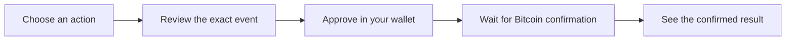

# Explore OP_DROP

> **Compact Bitcoin token events with a result you can follow.** OP_DROP keeps intent readable, confirmation meaningful, and transfer state visible.

## The promise

Every OP_DROP action follows the same understandable path:

- **Read before signing:** the compact event is visible before approval.
- **Count only what confirms:** pending activity never appears as confirmed supply or balance.
- **Follow every transfer:** units stay visible as available, reserved, settled, or returned.
- **Understand invalid events:** a rejected action can show why it did not change state.
- **Use one coherent view:** Explorer and Portfolio follow the same public rules.

## Choose your guide

| You want to… | Read this |
| --- | --- |
| Deploy, mint, or transfer for the first time | [Get started](guides/getting-started.md) |
| Check a token, event, or address | [Explorer and Portfolio](guides/op-drop-explorer.md) |
| Understand available, reserved, pending, or invalid | [Confirmed-state rules](indexing-rules.md) |
| Check the exact text you are signing | [Event format](protocols/op-drop-json.md) |
| Understand why OP_DROP is different | [Why OP_DROP](why-op-drop.md) |
| Read the BIP-110 READY badge correctly | [BIP-110 and OP_DROP](guides/bip110-compatibility.md) |

## The words you will see

| Word | What it means |
| --- | --- |
| **Confirmed** | The event passed the required checks and can affect OP_DROP state. |
| **Pending** | The action has not reached confirmed state and does not affect a balance. |
| **Available** | Confirmed units the address can use in a new transfer. |
| **Reserved** | Confirmed units waiting for a transfer to finish. |
| **Settled** | Reserved units reached a valid destination. |
| **Invalid** | The event did not pass a required rule and changes no balance. |

## `$DROP` basics

`$DROP` uses ticker `drop`, a planned maximum supply of 21,000,000 whole units, and a maximum valid mint of 1,000 units per event. Those terms take effect only after the deploy event is confirmed and accepted.

## Remember

- OP_DROP is separate from BRC-20 and Ordinals.
- A wallet preview or pending transaction is not a confirmed OP_DROP balance.
- Another service may apply or display different rules.
- Review the exact event, destination, amount, network, and fee before signing.
- Never share a seed phrase or private key.
